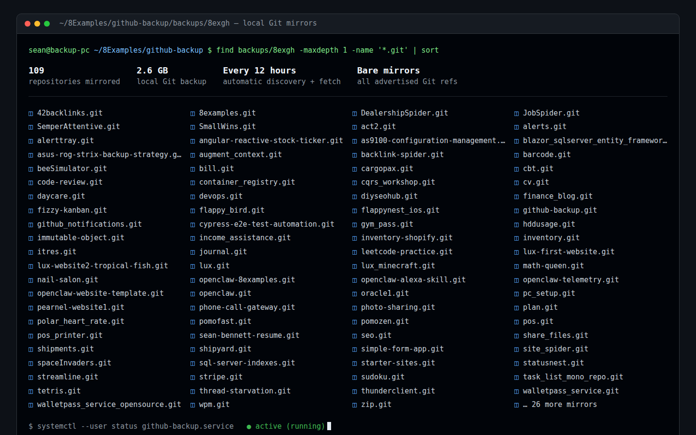

# GitHub Backup

`github-backup` is a small Go disaster-recovery service for GitHub repositories.
It discovers every public and private repository owned by the authenticated
personal account, creates a local bare mirror of each one, and checks GitHub
again every 12 hours for new repositories and changes.



## Why this exists

GitHub is the primary home for many projects, but it should not be the only copy.
A local mirror gives you an independent recovery path if:

- you are locked out of your GitHub account;
- the account is suspended, compromised, or deleted;
- a repository or branch is accidentally or maliciously deleted remotely;
- history is rewritten by a force-push or destructive rebase;
- tags are moved or deleted; or
- GitHub has an outage or another remote catastrophe.

This tool deliberately preserves more than the current remote state. Before
every update it enables reflogs and disables reflog/object expiry. If an upstream
branch or tag is deleted or force-pushed, its earlier object IDs remain in the
local mirror for recovery. That protection trades disk space for durability:
backup storage grows over time and should be monitored.

## What it does

On startup—and then once every configured interval—the program:

1. Authenticates to the GitHub API and identifies the token owner.
2. Lists every public and private repository owned by that personal account.
3. Clones each new repository with `git clone --mirror` into
   `BACKUP_DIR/OWNER/REPOSITORY.git`.
4. Updates every existing mirror with `git remote update --prune`, fetching all
   branches, tags, notes, commits, and other refs advertised by GitHub.
5. Keeps local mirrors when a repository disappears from GitHub.
6. Logs individual failures and continues backing up the remaining repositories.

These are bare Git mirrors, not working directories. They are intended for
complete storage and restoration rather than editing files in place.

## What it does not back up

The backup covers Git objects and advertised refs. It does not currently include
GitHub-only data such as:

- issues, discussions, pull-request comments, and review metadata;
- repository settings, collaborators, secrets, or branch protection rules;
- Actions artifacts and logs;
- release assets;
- wiki repositories; or
- Git LFS objects.

Those need separate export or backup tooling.

## Requirements

- Linux, macOS, or another system with Go and Git
- Go 1.22 or newer (only required to build)
- Git
- A GitHub personal access token
- systemd user services for the optional always-on Linux setup

## Required PAT access

The preferred credential is a **fine-grained personal access token** configured
as follows:

- **Resource owner:** your personal GitHub account
- **Repository access:** **All repositories** so repositories created later are
  discovered automatically
- **Repository permissions:** **Contents — Read-only**
- **Metadata:** Read-only, automatically included by GitHub

No write or administrative access is needed. If a fine-grained token cannot
cover the required repositories, a classic PAT with the broader `repo` scope
also works. Organization SSO policies may require separately authorizing a
classic token.

The program backs up repositories owned by the authenticated personal account.
It intentionally excludes organization-owned repositories and repositories
merely shared with the account.

## Build

```sh
git clone https://github.com/YOUR_ACCOUNT/github-backup.git
cd github-backup
go test ./...
go build -o github-backup .
```

## Run one backup manually

Create the destination and run a one-time validation:

```sh
mkdir -p backups
GITHUB_TOKEN='github_pat_...' ./github-backup -once -dir ./backups
```

Do not paste a real token directly into shell history on a shared machine. For a
long-running installation, use the protected environment-file approach below.
The program uses the token for the API and Git ask-pass authentication; it does
not put the token in saved remote URLs or intentionally print it.

## Run continuously with systemd

The following installs it as a per-user service. Adjust paths if the repository
is stored somewhere else.

1. Create a credential file beside the program:

   ```sh
   printf '%s\n' 'GITHUB_TOKEN=github_pat_REPLACE_ME' > .github-backup.env
   chmod 600 .github-backup.env
   ```

2. Copy `github-backup.service.example` into the user service directory:

   ```sh
   mkdir -p "$HOME/.config/systemd/user"
   cp github-backup.service.example \
     "$HOME/.config/systemd/user/github-backup.service"
   ```

3. Edit `ExecStart` and `EnvironmentFile` in the copied service so they contain
   the absolute locations of the executable, backup directory, and environment
   file. Systemd does not perform shell expansion in these values.

4. Reload systemd, enable the service, and start the first backup:

   ```sh
   systemctl --user daemon-reload
   systemctl --user enable --now github-backup.service
   ```

5. On Linux, allow the user service to run after reboot without waiting for an
   interactive login:

   ```sh
   loginctl enable-linger "$USER"
   ```

Check its status and follow the logs:

```sh
systemctl --user status github-backup.service
journalctl --user -u github-backup.service -f
```

After changing the token or service configuration, reload/restart it:

```sh
systemctl --user daemon-reload
systemctl --user restart github-backup.service
```

The included `.gitignore` excludes `backups/`, `.github-backup.env`, the locally
built executable, and local service configuration. Never commit the credential
file or the backup mirrors into this source repository.

## Command-line options

```text
-dir PATH           mirror destination (default ./backups)
-interval DURATION  time between cycles (default 12h)
-once               perform one cycle and exit
-api-url URL        API endpoint (for GitHub Enterprise Server)
```

The first cycle always starts immediately. The interval is measured from service
startup; later cycles run while the process remains active.

## Restore a repository

Create a normal working copy from a mirror:

```sh
git clone backups/OWNER/REPOSITORY.git restored-repository
```

To restore it to a new remote:

```sh
cd backups/OWNER/REPOSITORY.git
git push --mirror https://github.com/OWNER/NEW_REPOSITORY.git
```

`git push --mirror` overwrites refs at the destination. Only use it with a new or
deliberately selected recovery repository.

For history displaced by a force-push or deletion, inspect the mirror's reflogs:

```sh
git --git-dir=backups/OWNER/REPOSITORY.git reflog show --all
git --git-dir=backups/OWNER/REPOSITORY.git fsck --full --no-reflogs
```

Once the required commit is identified, create a recovery branch before copying
or pushing it elsewhere.

## Operational recommendations

- Rotate the PAT periodically and immediately after accidental disclosure.
- Protect the backup disk with full-disk encryption because private repository
  contents are stored unencrypted inside the Git object databases.
- Monitor free disk space; deliberately retained historical objects accumulate.
- Periodically test restoring a repository. An untested backup is only a hope.
- Consider copying the entire backup directory to a second encrypted disk so a
  failure of this PC does not remove the last independent copy.
